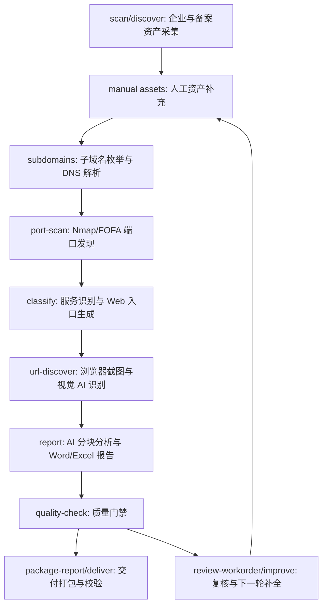

# assetmap

`assetmap` 是一个专用型 AI Agent：它只做一件事，就是围绕目标公司及其控股子公司，尽可能完整地测绘互联网数字资产暴露面，并生成可交付的 Word 报告和 Excel 附件。

它不是通用爬虫，也不是单个扫描器。它把企业股权/备案资产采集、人工资产补充、子域名/DNS、主动/被动端口发现、服务识别、Web 页面截图识别、AI 分块分析、质量门禁和交付打包串成一条可断点续跑的流水线。

## 一键运行

推荐普通用户优先使用一键命令：

```powershell
assetmap scan "苏州市能源发展集团有限公司"
```

这个命令会自动执行：

1. 采集目标公司、控股子公司、备案域名、APP、小程序、公众号、服务号、邮箱等基础资产。
2. 对根域名做子域名枚举和 DNS 解析。
3. 合并 DNS 推理 IP、手工 IP、FOFA 被动端口和 Nmap 主动扫描结果。
4. 识别端口上运行的服务，生成 Web URL 入口。
5. 打开 Web 页面截图，调用多模态 AI 识别系统名称、网站用途、页面类型和业务功能。
6. 分块调用 AI 分析 DNS、端口、Web 和总体暴露面。
7. 生成 Word 报告、两个 Excel 附件、质量门禁、复核工作单、补全计划和交付压缩包。
8. 校验交付包 manifest、文件大小、SHA256 和关键结构。

默认情况下，`scan` 会复用同名目标最近一次任务并断点续跑。只有确认要完全重新采集时才使用：

```powershell
assetmap scan "苏州市能源发展集团有限公司" --refresh
```

如果你有额外拿到的主域名、子域名、IP、URL、APP、小程序、公众号、服务号或邮箱，可以先写到手工资产文件，再一键运行：

```powershell
assetmap asset-template --output data/manual_assets.yaml
assetmap scan "苏州市能源发展集团有限公司" --manual-file data/manual_assets.yaml
```

严格交付模式：

```powershell
assetmap scan "苏州市能源发展集团有限公司" --strict
```

`--strict` 会在质量门禁存在警告时停止打包。日常测绘建议不用 `--strict`，因为中低等级缺口会被写进报告、复核工作单和补全计划。

## 初始化

首次使用：

```powershell
python -m venv .venv
.\.venv\Scripts\activate
pip install -e .[dev]
assetmap init
assetmap env-check
assetmap ai-check
```

`assetmap init` 会生成：

- `config.yaml`：主配置文件。
- `data/manual_assets.example.yaml`：手工资产补充模板。
- `data/assetmap.db`：SQLite 数据库。

公开仓库默认不提交本地 `config.yaml`、`ksubdomain.yaml`、`deliveries/`、`exports/` 和运行生成的 `data/` 结果文件。
从 GitHub 克隆后，先执行 `assetmap init`，或复制 `config.example.yaml` 为 `config.yaml` 后再填写你自己的密钥与本机网络参数。

`init` 默认不会覆盖已有 `config.yaml`。需要重新生成模板时才执行：

```powershell
assetmap init --force
```

## 配置重点

企业和备案资产采集使用项目内置脚本：

```yaml
enscan:
  script: assetmap/collectors/tyc_invest_crawler.py
  tycid: YOUR_TYCID
  auth_token: YOUR_TYC_AUTH_TOKEN
  request_delay_seconds: 1.0
  request_timeout_seconds: 20
  asset_workers: 1
```

端口发现可以主动、被动或两者同时开启：

```yaml
port_scan:
  target_sources_enabled:
    - ai
    - manual
    - dns_public
  sources_enabled:
    - fofa
    - nmap
fofa:
  email: YOUR_FOFA_EMAIL
  api_key: YOUR_FOFA_API_KEY
```

Web 截图与视觉识别：

```yaml
url_discovery:
  timeout_seconds: 15
  page_hard_timeout_seconds: 60
  visual_max_pages: 50
  browser_channel: chrome
  browser_headless: true
  browser_wait_until: domcontentloaded
  browser_wait_after_load_ms: 1500
  screenshot_width: 1365
  screenshot_height: 900
```

AI 配置：

```yaml
ai:
  enabled: true
  base_url: https://你的模型网关/v1
  api_key: YOUR_API_KEY
  api_key_header: api-key
  model: mimo-v2.5
```

## 流水线说明

完整流程如下：



### 1. 企业与备案资产采集

命令：

```powershell
assetmap discover "公司名称"
```

一键模式下由 `assetmap scan` 自动执行。

这一阶段会采集：

- 目标公司。
- 大于配置阈值的控股子公司。
- 股权路径、直接持股、累计持股。
- 备案域名。
- APP 备案。
- 小程序备案。
- 微信公众号和服务号。
- 邮箱等非域名资产。

默认断点续跑，同名目标会复用最近一次任务。完全重来使用 `--refresh`。

### 2. 人工资产补充

自动测绘不可能保证 100% 完整。其他途径拿到的资产应写入手工资产文件：

```yaml
units:
  - unit: 示例集团有限公司
    domains:
      - example.cn
    subdomains:
      - oa.example.cn
    ips:
      - 1.2.3.4
    urls:
      - url: https://portal.example.cn/
        system_name: 统一门户
        site_purpose: 员工登录入口
    apps:
      - name: 示例 APP
        package: cn.example.app
    mini_programs:
      - name: 示例小程序
        appid: wx123456
    wechat_official_accounts:
      - name: 示例公众号
        account: example-official
    wechat_service_accounts:
      - name: 示例服务号
        account: example-service
    emails:
      - security@example.cn
```

导入：

```powershell
assetmap import-assets <task_id> --file data/manual_assets.yaml
```

或在一键运行中自动导入：

```powershell
assetmap scan "公司名称" --manual-file data/manual_assets.yaml
```

手工资产按单位归属入库，后续报告会按公司维度汇总。

### 3. 子域名与 DNS

命令：

```powershell
assetmap run <task_id> --from-stage subdomains
```

系统会：

- 用 `subfinder` 做被动子域名枚举。
- 用 `ksubdomain` 和 `tools.wordlist` 做主动爆破。
- 解析 A/AAAA/CNAME/MX/TXT 等记录。
- 让 AI 从 DNS 记录中判断更可能是真实业务服务器的公网 IP。
- 生成 `data/subdomains/task_<task_id>/subdomain_audit.json`。

如果 DNS 污染或解析器异常，可配置 `dns.nameservers` 后重跑：

```powershell
assetmap run <task_id> --from-stage subdomains --rerun-dns
```

### 4. 端口发现

命令：

```powershell
assetmap run <task_id> --from-stage port-scan
```

目标 IP 来源：

- AI 从 DNS 记录中判断的真实公网 IP。
- 手工导入的 IP。
- DNS 解析出的公网 A/AAAA。

端口来源：

- `nmap`：主动扫描。
- `fofa`：被动搜索。

系统会合并去重主动和被动证据。FOFA-only 端口会作为线索保留；如果同时启用 Nmap，会对 FOFA 端口做精确主动验证。

审计文件：

- `data/nmap/task_<task_id>/target_sources.json`
- `data/nmap/task_<task_id>/fofa_errors.json`

### 5. 服务识别与 URL 入口

命令：

```powershell
assetmap run <task_id> --from-stage classify
```

系统会根据端口、协议、HTTP 探测、标题、Server、FOFA 信息等判断：

- Web 服务。
- 邮件服务。
- 数据库。
- 远程管理。
- VPN/网关。
- 其他未知服务。

审计文件：

- `data/classify/task_<task_id>/web_probe_audit.json`
- `data/classify/task_<task_id>/service_classification_audit.json`

### 6. Web 截图与视觉识别

命令：

```powershell
assetmap run <task_id> --from-stage url-discover
```

系统会：

- 从 Web 服务中生成 URL 入口。
- 用本机 Chrome 打开页面。
- 截图保存到 `data/screenshots/task_<task_id>/`。
- 把截图交给多模态 AI，识别系统名称、网站用途、页面类型、登录特征、业务功能。
- 对重复页面复用已有识别结果。
- 对截图失败但 HTTP 探测有证据的页面，降级为 HTTP 探测摘要。

为什么会出现白板截图或截图缺失：

- 页面本身加载后是空白页、跳转页或单页应用未渲染完成。
- 页面需要登录态、客户端证书、内网源地址或特定 Host Header。
- TLS/协议不匹配，例如 HTTP 请求打到了 HTTPS 端口。
- 页面阻断了自动化浏览器或返回了低价值错误页。
- 截图超时、页面长期挂起、下载响应、空响应。
- AI 图片分析失败时，系统可能保留截图但降级使用 HTTP 标题/服务信息。
- 重复页面复用识别结果时，不一定为每个 URL 生成独立截图。

当前优化：

- 页面 DOM 明显空白时，不再把白图当作成功截图。
- 空白页会等待额外时间和网络空闲后重试。
- 仍为空白则记录 `blank page after load`，并降级到 HTTP 探测摘要。
- `Web资产详情.xlsx` 的 `截图证据` Sheet 会给出 `截图状态` 和 `截图缺失原因`。
- `visual_analysis_audit.json` 会记录截图 AI、HTTP 降级、失败、低置信度样例。

重试失败或降级页面：

```powershell
assetmap run <task_id> --from-stage url-discover --retry-failed
```

全量重跑 URL 视觉识别：

```powershell
assetmap run <task_id> --from-stage url-discover --rerun-urls
```

### 7. 报告生成

命令：

```powershell
assetmap report <task_id>
```

报告会按四个分块调用 AI：

- DNS 与域名解析分析。
- 端口与服务暴露分析。
- Web 资产视觉识别分析。
- 总体暴露面结论与处置建议。

输出：

- `reports/task_<task_id>_<target>/task_<task_id>_互联网资产暴露面测绘报告.docx`
- `reports/task_<task_id>_<target>/task_<task_id>_资产汇总.xlsx`
- `reports/task_<task_id>_<target>/task_<task_id>_Web资产详情.xlsx`

报告 AI 审计：

- `data/report/task_<task_id>/report_ai_audit.json`

审计文件会记录每个 AI 分块的状态、模型、输入指纹、输入规模、响应 ID、响应模型和 token 用量，便于追溯报告结论。

### 8. 质量门禁、补全计划和交付

质量检查：

```powershell
assetmap quality-check <task_id>
```

生成复核工作单：

```powershell
assetmap review-workorder <task_id> --output data/review_workorder.task_<task_id>.yaml --force
```

生成补全计划：

```powershell
assetmap improve <task_id>
```

执行自动补全动作：

```powershell
assetmap improve <task_id> --execute
```

交付收口：

```powershell
assetmap deliver <task_id>
```

交付包包含：

- Word 报告。
- `资产汇总.xlsx`。
- `Web资产详情.xlsx`。
- 质量门禁摘要。
- 待补充资产模板。
- 复核工作单。
- 补全计划 JSON/TXT。
- 子域名、DNS、端口、FOFA、服务识别、URL 视觉识别、报告 AI 审计文件。
- 截图证据清单。
- `manifest.json`。
- `交付说明.txt`。

校验交付包：

```powershell
assetmap verify-package deliveries\task_<task_id>_<target>.zip
```

## 常用命令速查

最常用：

```powershell
assetmap scan "公司名称"
assetmap status <task_id>
assetmap quality-check <task_id>
assetmap deliver <task_id>
```

需要补资产：

```powershell
assetmap asset-gap-template <task_id> --priority high-medium --include-partial --force --output data/manual_assets.task_<task_id>.gaps.yaml
assetmap import-assets <task_id> --file data/manual_assets.task_<task_id>.gaps.yaml
assetmap run <task_id>
assetmap deliver <task_id>
```

需要复核并回写：

```powershell
assetmap review-workorder <task_id> --output data/review_workorder.task_<task_id>.yaml --force
assetmap import-review <task_id> --file data/review_workorder.task_<task_id>.yaml
assetmap deliver <task_id>
```

只重跑某个环节：

```powershell
assetmap run <task_id> --from-stage subdomains --rerun-dns
assetmap run <task_id> --from-stage port-scan --rerun-ports
assetmap run <task_id> --from-stage classify --rerun-classify
assetmap run <task_id> --from-stage url-discover --retry-failed
assetmap run <task_id> --from-stage report --rerun-ai
```

查看结果：

```powershell
assetmap show <task_id>
assetmap status <task_id>
assetmap export <task_id> --format json
```

## 断点续跑原则

- `discover "公司名称"` 和 `scan "公司名称"` 默认复用同名目标最近一次任务。
- `run <task_id>` 默认只跑未完成或受新增数据影响的后续环节。
- `url-discover` 默认不会反复重跑已成功识别的页面。
- `--retry-failed` 只补跑失败或 HTTP 降级页面。
- `--rerun-*` 才表示主动刷新某个环节。
- `--refresh` 才表示企业采集从头开始。

## 如何理解质量门禁

`quality-check` 的 `PASS/WARN/FAIL` 含义：

- `PASS`：结构和覆盖门禁都通过。
- `WARN`：可以交付，但存在中低等级缺口，交付包会附带补全计划和复核工作单。
- `FAIL`：关键交付物缺失、结构损坏或质量门禁失败，需要修复后再交付。

常见 WARN 不一定代表程序错误。例如：

- 某些控股项目公司确实没有独立互联网资产。
- FOFA-only 端口尚未主动验证。
- 某些 Web 页面需要登录态，只能降级识别。
- 某些 DNS 指向第三方、停放页或共享 IP，需要人工确认。

这些情况应通过 `review-workorder` 和 `import-review` 留痕，而不是盲目重跑。

## 项目边界

这个程序的本质是一个专用 Agent：

- 它会自主编排多个工具和模型。
- 它会保留中间证据和审计文件。
- 它会在自动化不足时生成复核工作单。
- 它会把结果组织成面向交付的 Word/Excel 报告。

它不追求替代人工判断。它追求把资产收集、证据归并、风险识别、复核闭环和报告交付变成一条稳定、可解释、可重复的流程。
