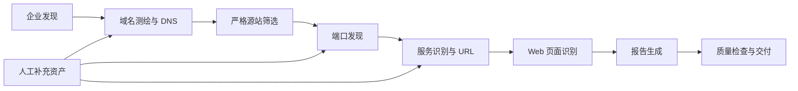

# assetmap

`assetmap` 是面向已授权目标的互联网资产暴露面测绘工具。它从企业及备案资产出发，逐步完成域名测绘、严格源站筛选、端口与服务识别、Web 页面识别，并生成 Word、Excel 和可校验的客户交付包。

它既可以一键运行，也可以将每个环节独立执行、排错后再从对应环节继续。所有阶段读写同一个 SQLite 任务库，因此不会因为拆分运行而丢失结果。

> 仅对你拥有明确授权的企业、域名和 IP 使用主动测绘功能。请勿将 API Key、`config.yaml`、数据库、原始证据或客户交付包提交到 Git。

## 你能得到什么

- 企业及控股子公司、备案域名和已关联数字资产。
- 根域名、子域名、DNS 记录和严格筛选后的源站候选 IP。
- Nmap 主动端口结果与 FOFA 被动证据，以及服务识别信息。
- Web URL、状态码、标题、技术指纹、渲染后 HTML 摘要和页面用途识别。
- Word 测绘报告、资产汇总 Excel、Web 资产详情 Excel。
- 质量门禁、待补充资产模板、复核工作单及校验过的 ZIP 交付包。

## 最快开始

以下流程适合第一次使用。请在仓库根目录执行。

### 1. 安装

需要 Python 3.9 或更高版本。建议一次安装测试、浏览器识别和本地图形控制台依赖：

```bash
python -m venv .venv
source .venv/bin/activate
python -m pip install -U pip
python -m pip install -e ".[dev,visual,web]"
playwright install chromium
```

Windows PowerShell 的激活命令是：

```powershell
.\.venv\Scripts\Activate.ps1
```

### 2. 初始化并安装外部工具

```bash
assetmap init
assetmap install-tools
```

`install-tools` 会安装 subfinder、dnsx、httpx；Nmap 会优先使用系统已安装版本。macOS 可使用 `brew install nmap`，Ubuntu/Debian 可使用 `sudo apt install nmap`。

### 3. 填写配置

初始化会生成本机的 `config.yaml`。请先复制 Subfinder Provider 配置样例：

```bash
cp config/subfinder/provider-config.example.yaml config/subfinder/provider-config.yaml
```

Windows PowerShell：

```powershell
Copy-Item config\subfinder\provider-config.example.yaml config\subfinder\provider-config.yaml
```

接着编辑 `config.yaml`，至少填写下列凭证：

```yaml
enterprise_discovery:
  tycid: YOUR_TYCID
  auth_token: YOUR_TYC_AUTH_TOKEN
  control_threshold: 0.47
  max_depth: 10

fofa:
  email: YOUR_FOFA_EMAIL
  api_key: YOUR_FOFA_API_KEY

ai:
  enabled: true
  base_url: https://你的网关/v1
  api_key: YOUR_API_KEY
  api_key_header: Authorization
  model: YOUR_TEXT_MODEL
```

也可使用交互式向导：

```bash
assetmap configure
```

最后检查环境和 AI 连通性：

```bash
assetmap env-check
assetmap ai-check
```

### 4. 执行一次完整测绘

```bash
assetmap scan "某某集团有限公司"
```

命令结束后会显示任务 ID。查看状态：

```bash
assetmap status <task_id>
```

## 选择合适的运行方式

| 目标 | 推荐命令 | 说明 |
| --- | --- | --- |
| 首次完整测绘并打包交付 | `assetmap scan "公司名称"` | 从企业发现开始，到报告、质量门禁和 ZIP 校验结束。 |
| 中断后继续完整流程 | `assetmap run <task_id>` | 自动跳过已完成阶段，只补未完成或受新增资产影响的后续阶段。 |
| 用新阶段名称编排流程 | `assetmap pipeline --task-id <task_id>` | 调用各独立阶段的统一编排器；不自动执行最终交付打包。 |
| 只调试一个环节 | `python -m assetmap.stages.<阶段名>` | 独立读写同一任务，适合排错。 |
| 仅重新生成交付物 | `assetmap deliver <task_id>` | 生成报告、执行质量检查、打包并校验。 |

### `scan`、`pipeline`、`run` 的区别

`scan` 是面向普通用户的一键命令：企业发现 → 全部测绘阶段 → 报告 → 质量门禁 → 客户 ZIP。

`pipeline` 只负责串联六个生产阶段，适合开发、调试或需要控制起止阶段的场景：

```bash
# 新建或复用同名任务，运行到报告生成。
assetmap pipeline "某某集团有限公司"

# 从已有任务的端口发现阶段继续到报告。
assetmap pipeline --task-id 12 --from-stage port-discovery
```

`run` 是兼容且推荐的续跑命令，底层也使用同一套独立阶段编排器：

```bash
assetmap run 12
assetmap run 12 --from-stage port-scan --rerun-ports
```

## 配置说明

`config.yaml` 只保存本机配置，已被 Git 忽略。示例文件为 `config.example.yaml`；默认模板位于 `assetmap/config.template.yaml`。

### 用户需要理解的配置

| 配置段 | 字段 | 是否必填 | 作用 |
| --- | --- | --- | --- |
| `enterprise_discovery` | `tycid`、`auth_token` | 是 | 天眼查企业、股权与备案资产采集凭证。 |
| `enterprise_discovery` | `control_threshold` | 是 | 控股追踪阈值，默认 `0.47`，表示持股比例大于或等于 47% 时继续追踪。 |
| `enterprise_discovery` | `max_depth` | 是 | 股权追踪深度，目标企业为第 0 层。 |
| `domain_mapping` | `subfinder_provider_config` | 是 | Subfinder 的 Provider Key 文件路径。文件可以先为空，但必须存在。 |
| `domain_mapping` | `dnsx_wordlist` | 是 | dnsx 使用的子域名字典路径，默认是项目内完整字典。 |
| `tools` | `nmap_command` | 是 | Nmap 全端口服务识别命令模板。除非你了解扫描影响，否则保持默认。 |
| `fofa` | `email`、`api_key` | 是 | FOFA 被动端口检索凭证。 |
| `ai` | `base_url`、`api_key`、`model` | 是 | OpenAI 兼容文本模型，用于 DNS 判断、页面识别和报告分析。 |
| `web_probe` | `timeout_seconds`、`user_agent` | 否 | httpx Web 探测的单请求超时和 UA。 |
| `url_discovery` | 三个超时字段 | 否 | 页面打开、单页硬超时和 AI 等待时间。 |

企业发现固定串行请求，请求前等待 0.2 秒，单次请求超时 6 秒，并默认跳过注销、吊销和经营异常企业。流程整体不设置总运行时限；中断后可续跑。

### Subfinder Provider Key

Subfinder 不配置 Provider Key 也可以运行，但被动子域名覆盖率会明显降低。程序会通过 `-pc` 显式传入：

```text
config/subfinder/provider-config.yaml
```

建议根据你实际开通的服务，在该文件中配置 Chaos、Censys、FOFA、GitHub、SecurityTrails、Shodan、ZoomEye、VirusTotal 等 Key。不要把 Key 粘贴到命令行、报告或仓库中。

## 流程是如何工作的



### 1. 企业发现 `enterprise-discovery`

采集目标公司、满足阈值的控股子公司、股权关系，以及备案域名、App、小程序、公众号、邮箱等资产。结果写入任务数据库。

```bash
python -m assetmap.stages.enterprise_discovery --target "某某集团有限公司"
python -m assetmap.stages.enterprise_discovery --task-id 12
```

### 2. 域名测绘 `domain-mapping`

对根域名运行 subfinder 和 dnsx，保存子域名及 DNS 证据。随后剔除 NS 基础设施、CNAME 链、CDN/WAF/云代理等非源站线索；仅将严格筛选并经 AI 高置信确认的 IP 送入后续主动扫描。

```bash
python -m assetmap.stages.domain_mapping --task-id 12
python -m assetmap.stages.domain_mapping --task-id 12 --rerun-tools --rerun-dns
```

> `--skip-ai` 仅用于诊断。启用后自动候选会全部排除，不应作为正式测绘结果。

### 3. 端口发现 `port-discovery`

只对已确认源站 IP 和人工确认 IP 进行 Nmap 主动扫描。FOFA 用于补充被动端口线索；仅 FOFA 有、首次 Nmap 未证实的端口会被使用 `-sV` 再次主动复核。

Python 侧固定串行调度。系统会识别“全端口 TCP 接收器”或大量 `tcpwrapped` 异常，不把大量伪开放端口误当真实服务。

```bash
python -m assetmap.stages.port_discovery --task-id 12
python -m assetmap.stages.port_discovery --task-id 12 --rerun
```

### 4. 服务识别 `service-identification`

使用 ProjectDiscovery httpx 识别 Web 服务，采集协议、状态码、标题、Server、技术指纹、页面哈希、favicon 哈希、CNAME、ASN、CDN/WAF 等信息。程序会优先使用符合端口习惯的协议，再在必要时回退另一种协议，以减少无效请求。

```bash
python -m assetmap.stages.service_identification --task-id 12
python -m assetmap.stages.service_identification --task-id 12 --rerun
```

### 5. Web 页面识别 `web-identification`

使用 Playwright Chromium 加载页面，保存渲染后的 HTML 和 DOM 摘要，再由文本 AI 识别系统名称、用途、页面类型、登录特征和业务功能。此方式不要求模型具备图片输入能力。

```bash
python -m assetmap.stages.web_identification --task-id 12
python -m assetmap.stages.web_identification --task-id 12 --retry-failed
```

普通续跑不会重复处理已保存的 `http_probe_fallback` 降级结果。若需要重做全部页面识别，请显式使用 `--rerun` 或 `assetmap run 12 --from-stage url-discover --rerun-urls`。

### 6. 报告生成 `report-generation`

将 DNS、端口、Web 和整体暴露面拆成四个 AI 分块分析，生成 Word 报告和两个 Excel 附件。AI 已完成但文件写入失败时，续跑会复用有效分析结果并重新写入文件。

```bash
python -m assetmap.stages.report_generation --task-id 12
python -m assetmap.stages.report_generation --task-id 12 --rerun-ai
```

## 人工补充资产

自动发现不能覆盖所有资产。你可以创建模板后导入根域名、子域名、IP、URL、App、小程序、公众号、服务号或邮箱。

```bash
assetmap asset-template --output data/manual_assets.yaml
assetmap import-assets 12 --file data/manual_assets.yaml --continue
```

也可在终端交互式添加：

```bash
assetmap add-asset 12
```

手动资产会写回同一任务数据库；导入后只会刷新受影响的后续阶段。

## 续跑、重跑和状态查看

先查看任务真实状态：

```bash
assetmap status 12
assetmap show 12
```

常用重跑命令：

```bash
# 仅重做 DNS，随后刷新后续阶段。
assetmap run 12 --from-stage subdomains --rerun-dns

# 重做子域名工具与 DNS。
assetmap run 12 --from-stage subdomains --rerun-subdomain-tools

# 重做端口发现。
assetmap run 12 --from-stage port-scan --rerun-ports

# 重做服务识别与 URL 入口。
assetmap run 12 --from-stage classify --rerun-classify

# 仅重试失败的页面。
assetmap run 12 --from-stage url-discover --retry-failed

# 重做全部页面识别。
assetmap run 12 --from-stage url-discover --rerun-urls

# 重算报告 AI 分析并重写报告。
assetmap run 12 --from-stage report --rerun-ai
```

完全重新采集同名目标时使用：

```bash
assetmap scan "某某集团有限公司" --refresh
```

## 报告、质量与客户交付

只生成报告：

```bash
assetmap report 12
```

检查交付质量：

```bash
assetmap quality-check 12
```

生成并校验客户交付包：

```bash
assetmap deliver 12
```

默认客户包不包含原始 HTML、审计 JSON 和复核工作单。如需内部复核材料，显式开启：

```bash
assetmap deliver 12 --include-internal-evidence
```

`PASS` 表示可交付；`WARN` 表示仍有覆盖缺口，但会在质量摘要中说明；`FAIL` 表示存在必须处理的问题，交付会停止。使用 `--strict` 可将任何 `WARN` 也作为停止条件。

```bash
assetmap deliver 12 --strict
assetmap verify-package deliveries/task_12_某某集团有限公司.zip
```

## 本地图形控制台

不熟悉命令行时，可以启动只监听本机回环地址的控制台：

```bash
assetmap ui
```

默认会打开 `http://127.0.0.1:8765`。页面提供配置引导、任务启动和续跑、实时日志、状态查看与交付包下载。关闭命令窗口即可停止服务。

## 文件与目录

```text
assetmap/
├── assetmap/
│   ├── cli/          命令入口
│   ├── stages/       六个可独立运行的生产阶段与统一编排器
│   ├── services/     采集、测绘、识别、交付、运营、运行环境能力
│   ├── collectors/   外部数据源适配器
│   └── web/          本地图形控制台
├── config/           Provider 配置样例；真实 Key 文件仅保存在本机
├── data/             SQLite、阶段证据、字典和运行结果
├── tools/            本机外部工具，不提交到 Git
├── reports/          Word 与 Excel 输出
├── deliveries/       客户交付目录和 ZIP
└── tests/            自动化测试
```

常用输出位置：

- `data/assetmap.db`：任务数据库。
- `data/subdomains/task_<id>/`：子域名、DNS 和源站筛选审计。
- `data/nmap/task_<id>/`：端口结果、FOFA 错误和端口异常审计。
- `data/classify/task_<id>/`：httpx 与服务识别审计。
- `data/rendered_html/task_<id>/`：渲染后的页面 HTML 证据。
- `reports/task_<id>_<目标>/`：Word 和 Excel 报告。
- `deliveries/task_<id>_<目标>.zip`：最终客户交付包。

## 常见问题

### `env-check` 提示 Provider 配置文件不存在

执行一次复制命令即可，即使你暂时没有 Provider Key：

```bash
cp config/subfinder/provider-config.example.yaml config/subfinder/provider-config.yaml
```

没有 Key 时 Subfinder 仍可能运行，但结果覆盖率会下降。

### Nmap 或 httpx 找不到

先执行：

```bash
assetmap install-tools
assetmap env-check
```

若 Nmap 仍缺失，请按操作系统安装 Nmap 后再次执行 `assetmap env-check`。

### FOFA 出现 `429 Too Many Requests`

这是 FOFA 侧频率限制。任务会记录已完成的 IP 查询并在后续续跑时避免重复完成项；等待额度恢复后使用：

```bash
assetmap run 12 --from-stage port-scan
```

### 页面识别很慢或失败

页面识别需要真实加载 JavaScript 页面，速度受目标响应、浏览器和 AI 网关影响。已完成页面不会在普通续跑中重复处理；只需重试失败页时使用：

```bash
assetmap run 12 --from-stage url-discover --retry-failed
```

### 任务中断了怎么办

不要删除数据库或阶段目录，直接续跑：

```bash
assetmap run 12
```

## 开发与验证

```bash
python -m pytest
python -m pytest tests/test_stage_pipeline.py
```

架构边界和模块职责见 [docs/ARCHITECTURE.md](docs/ARCHITECTURE.md)。
