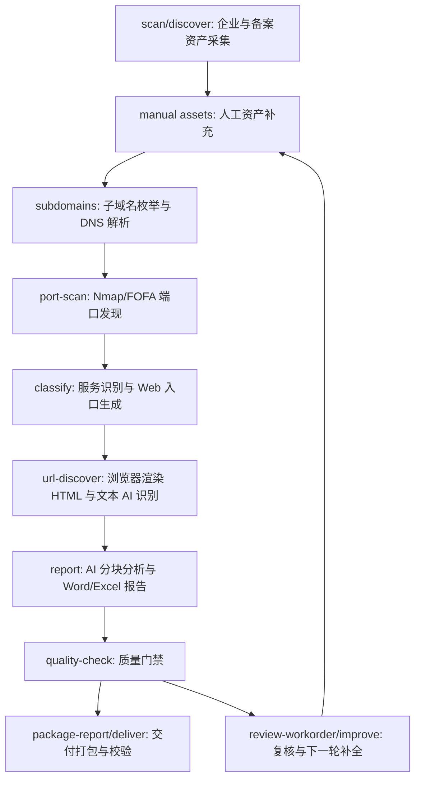

# assetmap

`assetmap` 是一个专用型 AI Agent：它只做一件事，就是围绕目标公司及其控股子公司，尽可能完整地测绘互联网数字资产暴露面，并生成可交付的 Word 报告和 Excel 附件。

它不是通用爬虫，也不是单个扫描器。它把企业股权/备案资产采集、人工资产补充、子域名/DNS、主动/被动端口发现、服务识别、Web 渲染 HTML 识别、AI 分块分析、质量门禁和交付打包串成一条可断点续跑的流水线。

## 一键运行

推荐普通用户优先使用一键命令：

```powershell
assetmap scan "苏州市能源发展集团有限公司"
```

这个命令会自动执行：

1. 采集目标公司、控股子公司、备案域名、APP、小程序、公众号、服务号、邮箱等基础资产。
2. 对根域名做子域名枚举和 DNS 解析。
3. 合并 DNS 推理 IP、手工 IP、FOFA 被动端口和 Nmap 主动扫描结果。
4. 识别端口上运行的服务，生成 Web URL 入口。
5. 用浏览器加载 Web 页面，保存渲染后的 HTML 和 DOM 摘要，再调用文本 AI 识别系统名称、网站用途、页面类型和业务功能。
6. 分块调用 AI 分析 DNS、端口、Web 和总体暴露面。
7. 生成 Word 报告、两个 Excel 附件、质量门禁和客户交付压缩包。
8. 校验交付包 manifest、文件大小、SHA256 和关键结构。

默认情况下，`scan` 会复用同名目标最近一次任务并断点续跑。只有确认要完全重新采集时才使用：

```powershell
assetmap scan "苏州市能源发展集团有限公司" --refresh
```

如果你有额外拿到的主域名、子域名、IP、URL、APP、小程序、公众号、服务号或邮箱，可以先写到手工资产文件，再一键运行：

```powershell
assetmap asset-template --output data/manual_assets.yaml
assetmap scan "苏州市能源发展集团有限公司" --manual-file data/manual_assets.yaml
```

严格交付模式：

```powershell
assetmap scan "苏州市能源发展集团有限公司" --strict
```

`--strict` 会在质量门禁存在警告时停止打包。客户正式交付建议使用该参数；中低等级缺口会明确写入报告与质量摘要。

## 初始化

首次使用：

```powershell
python -m venv .venv
.\.venv\Scripts\activate
python -m pip install -U pip
pip install -e .[dev] -i https://pypi.tuna.tsinghua.edu.cn/simple
assetmap init
assetmap env-check
assetmap ai-check
```

如果需要加载 JavaScript 页面并采集渲染后的 HTML，再安装浏览器自动化依赖：

```powershell
pip install -e .[visual]
playwright install chromium
```

完整开发环境可以一次安装：

```powershell
pip install -e .[dev,visual]
```

Linux 服务器上建议使用国内镜像并关闭 pip 版本检查，减少等待时间：

```bash
python -m pip install -U pip -i https://pypi.tuna.tsinghua.edu.cn/simple
python -m pip install -e ".[dev]" -i https://pypi.tuna.tsinghua.edu.cn/simple --disable-pip-version-check
python -m pip install -e ".[visual]" -i https://pypi.tuna.tsinghua.edu.cn/simple --disable-pip-version-check
```

`assetmap init` 会生成：

- `config.yaml`：主配置文件。
- `data/manual_assets.example.yaml`：手工资产补充模板。
- `data/assetmap.db`：SQLite 数据库。

公开仓库默认不提交本地 `config.yaml`、`deliveries/`、`exports/` 和运行生成的 `data/` 结果文件。
从 GitHub 克隆后，先执行 `assetmap init`，或复制 `config.example.yaml` 为 `config.yaml` 后再填写你自己的密钥与本机网络参数。

`init` 默认不会覆盖已有 `config.yaml`。需要重新生成模板时才执行：

```powershell
assetmap init --force
```

可用以下命令检查和准备本机环境：

```powershell
assetmap configure       # 交互式填写本地配置与 API 凭证
assetmap install-tools   # 安装 subfinder、dnsx、nmap、httpx
assetmap env-check       # 检查密钥、字典、工具与浏览器
assetmap ai-check        # 验证 AI 网关连通性
```

不熟悉命令行时，可安装图形控制台并启动本机页面：

```powershell
pip install -e ".[web]"
assetmap ui
```

浏览器会自动打开 `http://127.0.0.1:8765`。控制台只允许本机访问，提供环境引导、所有配置参数、任务启动/续跑、实时日志和交付包下载；关闭命令窗口即可停止。

所有命令都会以仓库根目录的 `config.yaml` 为基准解析数据库、`data/`、字典和工具目录；即使误在 `assetmap/` 子目录中执行，也不会再创建第二套任务数据。

## 配置重点

项目默认生成深度测绘配置：启用 Nmap 与 FOFA 双来源、全端口服务识别、完整子域名字典、AI 分析和浏览器渲染 HTML 取证。请只对已获授权的目标执行；首次运行前必须在 `config.yaml` 填写天眼查、FOFA 和 AI 凭证。

`assetmap scan` 会在开始任何外部采集前执行环境预检查；缺少凭证、扫描工具、字典或浏览器时会直接列出缺项并停止，避免产生不完整任务或无效外部请求。

### Subfinder Provider Key

`subfinder` 是默认的被动子域名发现工具，但它的覆盖率依赖各数据源的个人 API Key。没有 Key 也能运行，只是结果会明显变少；Key 不应写入 `config.yaml`、报告、命令行历史或 Git 仓库。

Subfinder 的 Provider 密钥使用项目内独立文件，程序会通过 `-pc` 显式指定它：

```text
config/subfinder/provider-config.yaml
```

先复制 `config/subfinder/provider-config.example.yaml`，再填写你自己的 Provider Key。真实文件已被 Git 忽略。建议优先按自身已开通的账号配置 Chaos、Censys、FOFA、GitHub、SecurityTrails、Shodan、ZoomEye、VirusTotal 等 Provider；请只填入你自己拥有且有权使用的密钥。

企业发现使用项目内置采集器。用户只需配置天眼查凭证和股权穿透范围：

```yaml
enterprise_discovery:
  tycid: YOUR_TYCID
  auth_token: YOUR_TYC_AUTH_TOKEN
  control_threshold: 0.47  # 持股比例大于或等于 47% 时继续追踪。
  max_depth: 10            # 目标企业为第 0 层。
```

为降低平台风控风险，采集器固定使用串行请求、每次请求前等待 0.2 秒、单次请求超时 6 秒、最多重试 3 次，并默认跳过注销、吊销和经营异常企业。任务没有总时限；中断后可利用检查点继续执行。

如需单独调试企业发现阶段，可直接运行：

```powershell
python -m assetmap.stages.enterprise_discovery --target "公司名称"
python -m assetmap.stages.enterprise_discovery --task-id 12
```

该入口与完整流水线复用同一套生产阶段逻辑；`--fresh` 仅可与 `--target` 一起使用。

### 统一编排与独立调试

每个环节都可以单独运行，统一流程也**只调用这些独立阶段的公开入口**，不会另有一套隐藏的服务调用路径。阶段之间通过同一个 SQLite 任务库衔接，因此可以先独立调试任一阶段，再从该阶段继续完整流程。

```powershell
# 从企业发现开始，顺序执行全部独立阶段。
assetmap pipeline "公司名称"

# 从已有任务的端口发现开始，继续到报告。
assetmap pipeline --task-id <task_id> --from-stage port-discovery

# 与旧命令兼容：assetmap run 现在也使用相同的独立阶段编排器。
assetmap run <task_id>
```

统一编排阶段名称为：`enterprise-discovery`、`domain-mapping`、`port-discovery`、`service-identification`、`web-identification`、`report-generation`。旧名称 `subdomains`、`port-scan`、`classify`、`url-discover`、`report` 仍可用于 `assetmap run` 和 `--from-stage`，以保证已有操作习惯不受影响。

普通续跑会跳过完成的阶段；域名/DNS 阶段存在可恢复缺口时会自动补跑。页面的 `http_probe_fallback` 属于已保存的降级结果，普通续跑不会重新打开浏览器；需要时请显式增加 `--retry-failed` 或 `--rerun-urls`。

端口发现固定同时执行两种来源：Nmap 对已确认源站 IP 做全端口服务识别；FOFA 提供被动端口线索，程序只会对「FOFA 有、首次 Nmap 未证实」的端口逐个再次使用 `-sV` 主动复核。Python 侧串行执行，且不设置批量任务总时限。

```yaml
domain_mapping:
  subfinder_provider_config: config/subfinder/provider-config.yaml
  dnsx_wordlist: data/wordlists/Subdomain.txt
tools:
  nmap_command: '{binary} -Pn -p- --open -sV --version-intensity 5 -iL {targets_file} -oX {xml_output} -oN {normal_output}'
fofa:
  email: YOUR_FOFA_EMAIL
  api_key: YOUR_FOFA_API_KEY
```

端口发现也可独立调试；它读取同一任务中域名测绘已确认的源站 IP，并把结果写回同一个数据库：

```powershell
python -m assetmap.stages.port_discovery --task-id 12
python -m assetmap.stages.port_discovery --task-id 12 --rerun
```

AI 配置：

```yaml
ai:
  enabled: true
  base_url: https://你的模型网关/v1
  api_key: YOUR_API_KEY
  api_key_header: api-key
  model: mimo-v2.5
```

## 流水线说明

代码目录与模块依赖说明见 [docs/ARCHITECTURE.md](docs/ARCHITECTURE.md)。服务层按资产采集、网络测绘、识别、交付、运营和运行环境六类职责组织。

完整流程如下：



### 1. 企业与备案资产采集

命令：

```powershell
assetmap discover "公司名称"
```

一键模式下由 `assetmap scan` 自动执行。

这一阶段会采集：

- 目标公司。
- 大于配置阈值的控股子公司。
- 股权路径、直接持股、累计持股。
- 备案域名。
- APP 备案。
- 小程序备案。
- 微信公众号和服务号。
- 邮箱等非域名资产。

默认断点续跑，同名目标会复用最近一次任务。完全重来使用 `--refresh`。

### 2. 人工资产补充

自动测绘不可能保证 100% 完整。其他途径拿到的资产应写入手工资产文件：

```yaml
units:
  - unit: 示例集团有限公司
    domains:
      - example.cn
    subdomains:
      - oa.example.cn
    ips:
      - 1.2.3.4
    urls:
      - url: https://portal.example.cn/
        system_name: 统一门户
        site_purpose: 员工登录入口
    apps:
      - name: 示例 APP
        package: cn.example.app
    mini_programs:
      - name: 示例小程序
        appid: wx123456
    wechat_official_accounts:
      - name: 示例公众号
        account: example-official
    wechat_service_accounts:
      - name: 示例服务号
        account: example-service
    emails:
      - security@example.cn
```

导入：

```powershell
assetmap import-assets <task_id> --file data/manual_assets.yaml
```

或在一键运行中自动导入：

```powershell
assetmap scan "公司名称" --manual-file data/manual_assets.yaml
```

手工资产按单位归属入库，后续报告会按公司维度汇总。

### 3. 子域名与 DNS

命令：

```powershell
assetmap run <task_id> --from-stage subdomains
```

系统会：

- 用 `subfinder` 做被动子域名枚举。
- 用 `dnsx` 和 `domain_mapping.dnsx_wordlist` 做主动子域名发现与 DNS 解析。
- 解析 A/AAAA/CNAME/MX/TXT 等记录。
- 串行执行工具和 DNS 查询；外部工具自身的并发参数不受影响。
- 先硬性剔除 NS 基础设施、所有 CNAME 链相关地址、已知 CDN/WAF 代理网段等非源站候选。
- 仅让 AI 审核剩余的直连 A/AAAA 候选；只有 `include + high` 才会进入主动扫描。
- 生成 `data/subdomains/task_<task_id>/subdomain_audit.json`。

工具任务不设置总时限。解析失败会在下一次普通 `assetmap run <task_id>` 时自动补试；不需要先删除数据库记录。

也可以独立调试域名测绘阶段：

```powershell
python -m assetmap.stages.domain_mapping --task-id 12
python -m assetmap.stages.domain_mapping --task-id 12 --rerun-tools --rerun-dns
```

### 4. 端口发现

命令：

```powershell
assetmap run <task_id> --from-stage port-scan
```

目标 IP 只来自域名测绘阶段中持久化的严格源站决策：AI 高置信放行的源站 IP，以及手工确认的 IP。普通 DNS 公网 A/AAAA 记录不会直接进入主动扫描。

端口来源：

- `nmap`：主动扫描。
- `fofa`：被动搜索。

系统会合并去重主动和被动证据。FOFA-only 端口会作为线索保留；如果同时启用 Nmap，会对 FOFA 端口做精确主动验证。

主 Nmap 命令已经包含高强度服务识别，因此分类阶段会复用已有结果，避免重复扫描；只有 FOFA 独有端口或自定义主扫描未启用服务识别时才会补充验证。失败的 Nmap/FOFA 验证任务同样会在普通续跑时自动重试。

审计文件：

- `data/nmap/task_<task_id>/target_sources.json`
- `data/nmap/task_<task_id>/fofa_errors.json`
- `data/nmap/task_<task_id>/port_anomaly_audit.json`（全端口 TCP 接收/`tcpwrapped` 等异常响应）

端口发现会先用 8 个分散端口做轻量预检。若某个 IP 对所有预检端口都返回开放，系统会将其标记为“疑似 TCP 全端口接收器”，跳过该 IP 的全端口 `-sV` 扫描，不把数万个 `tcpwrapped` 结果当作真实服务；原始预检证据与判断规则会写入异常响应审计文件。

### 5. 服务识别与 URL 入口

命令：

```powershell
assetmap run <task_id> --from-stage classify
python -m assetmap.stages.service_identification --task-id <task_id>
```

系统会根据端口、协议、HTTP 探测、标题、Server、FOFA 信息等判断：

- Web 服务。
- 邮件服务。
- 数据库。
- 远程管理。
- VPN/网关。
- 其他未知服务。

服务识别由 ProjectDiscovery `httpx` 执行：它会输出状态码、标题、Web Server、技术指纹、页面哈希、favicon 哈希、CNAME、ASN 与 CDN/WAF 线索。程序会为每个已发现域名保留完整 URL，以保留虚拟主机和 TLS SNI；80 等端口先尝试 HTTP，443/8443/9443 先尝试 HTTPS，只有首次协议没有响应时才会回退另一种协议。Python 只顺序执行“首选协议”和“回退协议”两个批次；httpx 在单个批次内固定 30 并发、每秒最多 100 请求，终端会显示其统计进度。

用户只需配置下列 Web 探测参数；httpx 的输出字段、重试、内部并发和限速策略由程序固定管理：

```yaml
web_probe:
  timeout_seconds: 8.0
  user_agent: Mozilla/5.0 (...) Chrome/... Safari/537.36
```

审计文件：

- `data/classify/task_<task_id>/web_probe_audit.json`
- `data/classify/task_<task_id>/service_classification_audit.json`

### 6. Web 渲染 HTML 与智能识别

命令：

```powershell
assetmap run <task_id> --from-stage url-discover
```

系统会：

- 从 Web 服务中生成 URL 入口。
- 用 Playwright Chromium 打开页面；整个阶段复用同一个浏览器会话，逐页处理。
- 将 JavaScript 加载完成后的 HTML 保存到 `data/rendered_html/task_<task_id>/`，并提取标题、可见文本、表单和链接摘要。
- 将这些文本证据交给 AI，识别系统名称、网站用途、页面类型、登录特征、业务功能；不要求模型支持图片输入。
- 对重复页面复用已有识别结果。
- 对页面渲染失败但 HTTP 探测有证据的页面，降级为 HTTP 探测摘要。

为什么会出现渲染 HTML 缺失：

- 页面本身加载后是空白页、跳转页或单页应用未渲染完成。
- 页面需要登录态、客户端证书、内网源地址或特定 Host Header。
- TLS/协议不匹配，例如 HTTP 请求打到了 HTTPS 端口。
- 页面阻断了自动化浏览器或返回了低价值错误页。
- 页面加载超时、页面长期挂起、下载响应、空响应。
- AI 文本分析失败时，系统会保留 HTML 证据并降级使用 HTTP 标题/服务信息。
- 重复页面复用识别结果时，不一定为每个 URL 保存独立 HTML 文件。

当前优化：

- 页面 DOM 明显空白时，不再把它当作成功页面。
- 空白页会等待额外时间和网络空闲后重试。
- 浏览器不会为每个 URL 重复启动；单页超时或浏览器异常时才关闭并重建会话。
- 仍为空白则记录 `blank page after load`，并降级到 HTTP 探测摘要。
- `Web资产详情.xlsx` 会给出 HTML 证据路径、识别方式和复核原因。
- `visual_analysis_audit.json` 会记录 HTML AI、HTTP 降级、失败、低置信度样例。

重试失败或降级页面：

```powershell
assetmap run <task_id> --from-stage url-discover --retry-failed
```

全量重跑 URL 页面识别：

```powershell
assetmap run <task_id> --from-stage url-discover --rerun-urls
```

### 7. 报告生成

命令：

```powershell
assetmap report <task_id>
```

也可单独执行这一阶段，便于调试报告而不触发交付打包：

```powershell
python -m assetmap.stages.report_generation --task-id <task_id>
python -m assetmap.stages.report_generation --task-id <task_id> --rerun-ai
```

报告会按四个分块调用 AI：

- DNS 与域名解析分析。
- 端口与服务暴露分析。
- Web 资产页面识别分析。
- 总体暴露面结论与处置建议。

端口和 Web 数据量较大时，AI 会优先分析本地风险分值更高、敏感服务、远程接入及登录/管理入口；完整明细仍全部保留在 Excel 附件中。

输出：

- `reports/task_<task_id>_<target>/task_<task_id>_互联网资产暴露面测绘报告.docx`
- `reports/task_<task_id>_<target>/task_<task_id>_资产汇总.xlsx`
- `reports/task_<task_id>_<target>/task_<task_id>_Web资产详情.xlsx`

报告 AI 审计：

- `data/report/task_<task_id>/report_ai_audit.json`

审计文件会记录每个 AI 分块的状态、模型、输入指纹、输入规模、响应 ID、响应模型和 token 用量，便于追溯报告结论。

报告生成会单独记录 Word 与 Excel 的写入状态。若 AI 分块已经完成但文件写入失败，下一次 `assetmap run <task_id> --from-stage report` 会复用有效 AI 结果并重新生成附件，不会把旧的 AI 缓存误判为完整报告。

### 8. 质量门禁、补全计划和交付

质量检查：

```powershell
assetmap quality-check <task_id>
```

生成复核工作单：

```powershell
assetmap review-workorder <task_id> --output data/review_workorder.task_<task_id>.yaml --force
```

生成补全计划：

```powershell
assetmap improve <task_id>
```

执行自动补全动作：

```powershell
assetmap improve <task_id> --execute
```

交付收口：

```powershell
assetmap deliver <task_id>
```

默认的客户交付包包含：

- Word 报告。
- `资产汇总.xlsx`。
- `Web资产详情.xlsx`。
- 质量门禁摘要。
- `manifest.json`。
- `交付说明.txt`。

默认包不包含原始渲染 HTML、运行日志、审计 JSON、复核工作单和补全计划，避免将页面内容、本机路径或内部诊断信息交给客户。

如需给项目组留存完整审计材料，明确使用内部审计包选项：

```powershell
assetmap deliver <task_id> --include-internal-evidence
```

该包可能含原始网页 HTML 和运行审计，只能在授权范围内由项目组保管，不能作为客户常规分发材料。

打包会先在临时目录完整构建并生成 ZIP，全部成功后才替换正式交付包；中途失败时，已有的交付目录和 ZIP 会被保留。

校验交付包：

```powershell
assetmap verify-package deliveries\task_<task_id>_<target>.zip
```

## 常用命令速查

最常用：

```powershell
assetmap scan "公司名称"
assetmap pipeline "公司名称"
assetmap status <task_id>
assetmap quality-check <task_id>
assetmap deliver <task_id>
```

需要补资产：

```powershell
assetmap asset-gap-template <task_id> --priority high-medium --include-partial --force --output data/manual_assets.task_<task_id>.gaps.yaml
assetmap import-assets <task_id> --file data/manual_assets.task_<task_id>.gaps.yaml
assetmap run <task_id>
assetmap deliver <task_id>
```

需要复核并回写：

```powershell
assetmap review-workorder <task_id> --output data/review_workorder.task_<task_id>.yaml --force
assetmap import-review <task_id> --file data/review_workorder.task_<task_id>.yaml
assetmap deliver <task_id>
```

只重跑某个环节：

```powershell
assetmap run <task_id> --from-stage subdomains --rerun-dns
assetmap run <task_id> --from-stage port-scan --rerun-ports
assetmap run <task_id> --from-stage classify --rerun-classify
assetmap run <task_id> --from-stage url-discover --retry-failed
assetmap run <task_id> --from-stage report --rerun-ai

# 使用独立阶段名称也可以
assetmap pipeline --task-id <task_id> --from-stage service-identification
```

查看结果：

```powershell
assetmap show <task_id>
assetmap status <task_id>
assetmap export <task_id> --format json
```

## 断点续跑原则

- `discover "公司名称"` 和 `scan "公司名称"` 默认复用同名目标最近一次任务。
- `run <task_id>` 与 `pipeline --task-id <task_id>` 默认只跑未完成或受新增数据影响的后续环节；二者均通过同一套独立阶段编排器执行。
- 已完成但仍存在子域名/DNS、Nmap 或 FOFA 子任务失败时，状态会显示为 `completed_with_errors`；普通 `run` 会自动重试这些项。
- `url-discover` 默认不会反复重跑已成功识别的页面。
- `--retry-failed` 只补跑失败或 HTTP 降级页面。
- `--rerun-*` 才表示主动刷新某个环节。
- `--refresh` 才表示企业采集从头开始。

## 如何理解质量门禁

`quality-check` 的 `PASS/WARN/FAIL` 含义：

- `PASS`：结构和覆盖门禁都通过。
- `WARN`：存在中低等级缺口；是否交付由项目负责人确认，使用 `--strict` 可阻止打包。
- `FAIL`：关键交付物缺失、结构损坏或质量门禁失败，需要修复后再交付。

常见 WARN 不一定代表程序错误。例如：

- 某些控股项目公司确实没有独立互联网资产。
- FOFA-only 端口尚未主动验证。
- 某些 Web 页面需要登录态，只能降级识别。
- 某些 DNS 指向第三方、停放页或共享 IP，需要人工确认。

这些情况应通过 `review-workorder` 和 `import-review` 留痕，而不是盲目重跑。

## 项目边界

这个程序的本质是一个专用 Agent：

- 它会自主编排多个工具和模型。
- 它会保留中间证据和审计文件。
- 它会在自动化不足时生成复核工作单。
- 它会把结果组织成面向交付的 Word/Excel 报告。

它不追求替代人工判断。它追求把资产收集、证据归并、风险识别、复核闭环和报告交付变成一条稳定、可解释、可重复的流程。
